# TP3 — Déploiement d'une Architecture 3-Tiers avec Vagrant

## Objectif du TP

L'objectif de ce TP est de déployer une application web complète en suivant une architecture **3-tiers** :
- **Tier 1 (Présentation)** : Application React servie par Nginx
- **Tier 2 (Logique métier)** : API REST Spring Boot (Java)
- **Tier 3 (Données)** : Base de données MySQL

Chaque tier est isolé sur une machine virtuelle distincte, ce qui reproduit un environnement de production réaliste.

---

## Architecture

| VM | Hostname | IP Privée | Rôle |
|---|---|---|---|
| server-back | server-back | 192.168.56.10 | Backend Spring Boot (port 8080→8082) |
| server-dba | server-dba | 192.168.56.11 | Base de données MySQL 8.0 |
| server-front | server-front | 192.168.56.12 | Frontend React + Nginx (port 80→8083) |

```
Machine Hôte (Windows)
        |
        |── localhost:8083 ──► server-front (React + Nginx)
        |                              |
        |                              | HTTP fetch vers 192.168.56.10:8080
        |                              ▼
        |── localhost:8082 ──► server-back (Spring Boot)
                                       |
                                       | JDBC vers 192.168.56.11:3306
                                       ▼
                               server-dba (MySQL)
```

---

## 1. Prérequis

- [Vagrant](https://www.vagrantup.com/) — outil de gestion de VMs en ligne de commande
- [VirtualBox](https://www.virtualbox.org/) — hyperviseur pour créer les machines virtuelles

---

## 2. Configuration des VMs (Vagrantfiles)

Chaque VM est définie par un fichier `Vagrantfile`. Les IPs doivent être **différentes** pour éviter les conflits réseau.

**server-back/Vagrantfile**
```ruby
Vagrant.configure("2") do |config|
  config.vm.box = "ubuntu/focal64"
  config.vm.hostname = "server-back"
  config.vm.network "forwarded_port", guest: 8080, host: 8082
  config.vm.network "private_network", ip: "192.168.56.10"
  config.vm.provider "virtualbox" do |vb|
    vb.memory = "2048"
    vb.cpus = 2
  end
end
```

**server-dba/Vagrantfile**
```ruby
Vagrant.configure("2") do |config|
  config.vm.box = "ubuntu/focal64"
  config.vm.hostname = "server-dba"
  config.vm.network "private_network", ip: "192.168.56.11"
  config.vm.provider "virtualbox" do |vb|
    vb.memory = "1024"
    vb.cpus = 1
  end
end
```

**server-front/Vagrantfile**
```ruby
Vagrant.configure("2") do |config|
  config.vm.box = "ubuntu/focal64"
  config.vm.hostname = "server-front"
  config.vm.network "forwarded_port", guest: 80, host: 8083
  config.vm.network "private_network", ip: "192.168.56.12"
  config.vm.provider "virtualbox" do |vb|
    vb.memory = "1024"
    vb.cpus = 1
  end
end
```

## Démarrage des VMs

Ouvrir **3 terminaux séparés** et lancer chaque VM :

```bash
# Terminal 1 — server-back
cd server-back
vagrant up      # Crée et démarre la VM
vagrant ssh     # Connexion SSH dans la VM

# Terminal 2 — server-dba
cd server-dba
vagrant up
vagrant ssh

# Terminal 3 — server-front
cd server-front
vagrant up
vagrant ssh
```

---

## 3. Déploiement de la Base de Données (server-dba)

> On commence par la base de données car le backend en a besoin pour démarrer.

### 3.1 Mise à jour du système

Avant toute installation, on corrige le DNS (problème fréquent avec VirtualBox) et on met à jour la liste des paquets :

```bash
# Fix DNS — VirtualBox ne résout pas toujours les noms de domaine
echo "nameserver 8.8.8.8" | sudo tee /etc/resolv.conf

# Met à jour la liste des paquets disponibles
sudo apt update
```

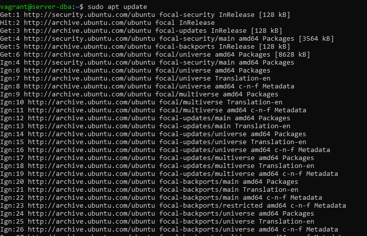

---

### 3.2 Installation de MySQL Server

```bash
# Installe MySQL Server et tous ses composants
sudo apt install -y mysql-server
```

> Le `-y` répond automatiquement "oui" à toutes les confirmations d'installation.

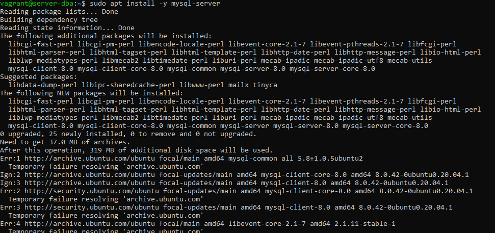

---

### 3.3 Vérification du service MySQL

```bash
# Vérifie que MySQL est bien démarré (doit afficher "active (running)")
sudo systemctl status mysql

# Se connecte à MySQL en tant que root (sans mot de passe grâce à auth_socket)
sudo mysql
```

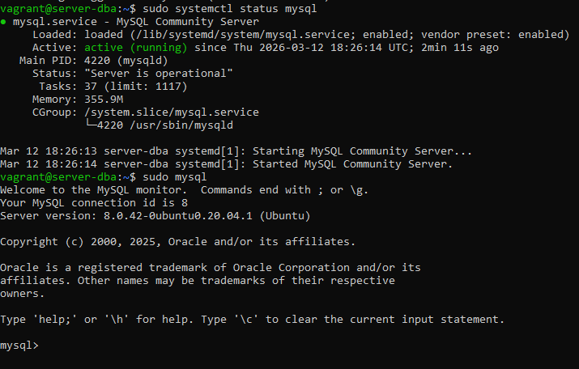

---

### 3.4 Création de la base de données et de l'utilisateur

On crée la base de données `appdb` et l'utilisateur `appuser` que le backend utilisera pour se connecter :

```sql
-- Crée la base de données
CREATE DATABASE appdb;

-- Crée l'utilisateur avec accès depuis n'importe quelle IP (%)
-- On utilise mysql_native_password pour la compatibilité avec le driver JDBC Java
CREATE USER 'appuser'@'%' IDENTIFIED WITH mysql_native_password BY 'password';

-- Donne tous les droits sur la base appdb à appuser
GRANT ALL PRIVILEGES ON appdb.* TO 'appuser'@'%';

-- Applique les changements de droits immédiatement
FLUSH PRIVILEGES;

-- Vérifie que la base a bien été créée
SHOW DATABASES;

-- Vérifie que l'utilisateur existe avec le bon host
SELECT user, host FROM mysql.user WHERE user = 'appuser';

EXIT;
```

> **Pourquoi `mysql_native_password` ?** MySQL 8 utilise par défaut `caching_sha2_password` qui est incompatible avec certains drivers JDBC Java. On force l'ancien plugin pour assurer la compatibilité.

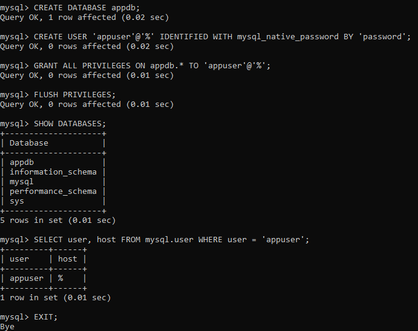

---

### 3.5 Configuration bind-address

Par défaut, MySQL n'écoute que sur `127.0.0.1` (localhost), ce qui empêche les connexions depuis les autres VMs. On change ça :

```bash
# Ouvre le fichier de configuration MySQL
sudo nano /etc/mysql/mysql.conf.d/mysqld.cnf
```

Changer la ligne :
```ini
# Avant (écoute uniquement localhost)
bind-address = 127.0.0.1

# Après (écoute sur toutes les interfaces réseau)
bind-address = 0.0.0.0
```

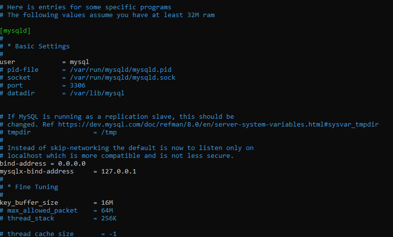

---

### 3.6 Vérification de l'écoute sur le port 3306

```bash
# Redémarre MySQL pour appliquer la nouvelle configuration
sudo systemctl restart mysql

# Vérifie sur quelle interface MySQL écoute
# On doit voir 0.0.0.0:3306 (toutes interfaces) et non 127.0.0.1:3306
sudo ss -tlnp | grep 3306
```

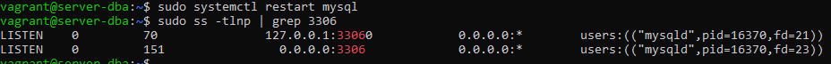

---

## 4. Déploiement du Backend (server-back)

### 4.1 Mise à jour du système

```bash
echo "nameserver 8.8.8.8" | sudo tee /etc/resolv.conf
sudo apt update
```

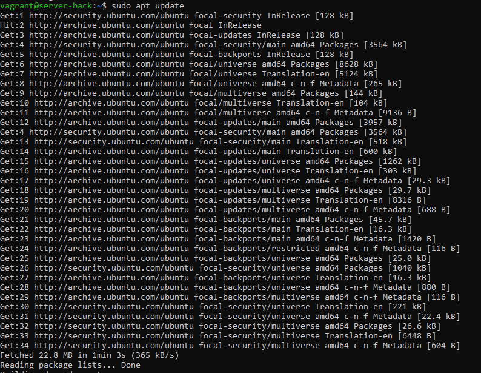

---

### 4.2 Installation de JDK 17

Spring Boot 3.x nécessite Java 17 minimum :

```bash
# Installe le JDK 17 (Java Development Kit)
sudo apt install -y openjdk-17-jdk

# Vérifie la version installée
java -version
```

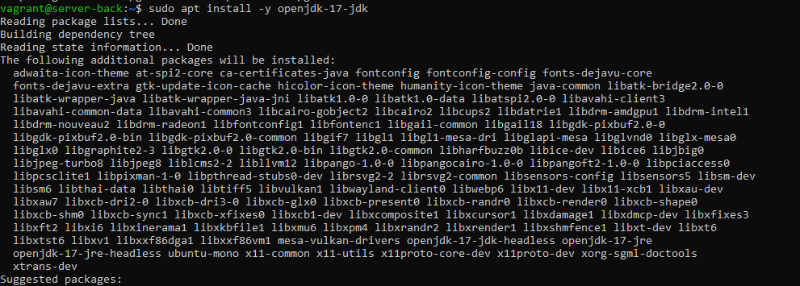

---

### 4.3 Création de la structure du projet Spring Boot

On crée manuellement la structure d'un projet Maven standard :

```bash
# Crée les dossiers du projet
mkdir -p /home/vagrant/springapp/src/main/java/com/example
mkdir -p /home/vagrant/springapp/src/main/resources
```

```
springapp/
├── pom.xml                          ← Configuration Maven (dépendances)
└── src/
    └── main/
        ├── java/com/example/
        │   ├── Application.java     ← Point d'entrée Spring Boot
        │   └── HelloController.java ← API REST avec endpoints
        └── resources/
            └── application.properties ← Config BDD, port...
```

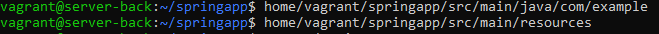

---

### 4.4 Création des fichiers de configuration

**application.properties** — Configuration de la connexion à MySQL :

```properties
# URL de connexion JDBC vers server-dba (192.168.56.11)
spring.datasource.url=jdbc:mysql://192.168.56.11:3306/appdb?useSSL=false&allowPublicKeyRetrieval=true
spring.datasource.username=appuser
spring.datasource.password=password
spring.datasource.driver-class-name=com.mysql.cj.jdbc.Driver

# Hibernate crée/met à jour les tables automatiquement
spring.jpa.hibernate.ddl-auto=update

# L'application écoute sur le port 8080
server.port=8080
```

**HelloController.java** — API REST avec 2 endpoints :

```java
@RestController
@CrossOrigin(origins = "*")  // Autorise les requêtes depuis le frontend React
public class HelloController {

    @GetMapping("/")           // GET http://server-back:8080/
    public String hello() {
        return "<h1>Hello from Spring Boot!</h1>";
    }

    @GetMapping("/db")         // GET http://server-back:8080/db
    public String testDb() {
        // Teste la connexion à MySQL et retourne la version
    }
}
```

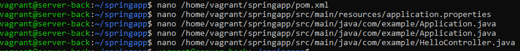

---

### 4.5 Lancement de Spring Boot

```bash
# Installe Maven (outil de build Java)
sudo apt install -y maven

# Se place dans le dossier du projet
cd /home/vagrant/springapp

# Télécharge les dépendances et lance l'application
# (Premier lancement peut prendre plusieurs minutes)
mvn spring-boot:run
```

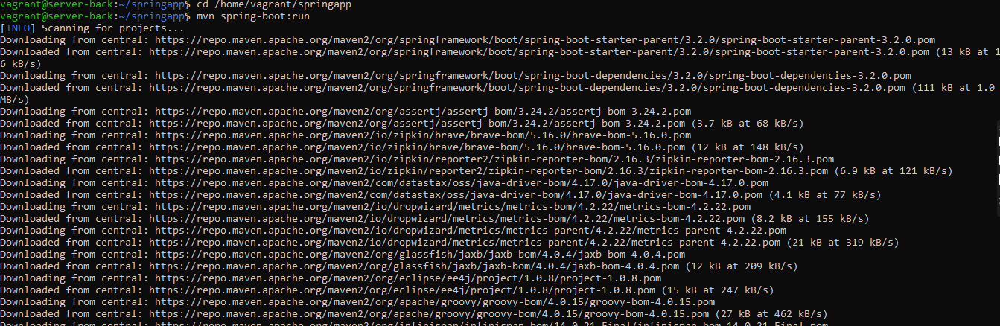

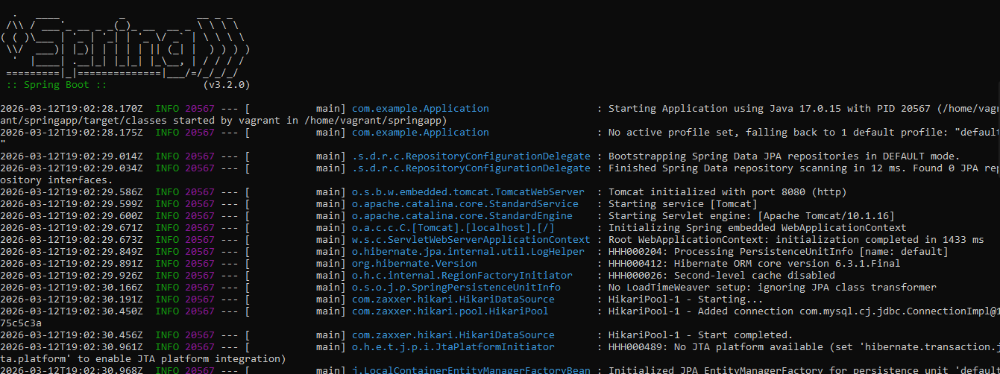

---

### 4.6 Tests du backend

Depuis le navigateur de la machine hôte :

**Test endpoint `/` — accessible sur `http://localhost:8082/`**

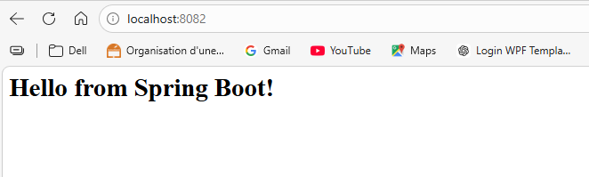

**Test endpoint `/db` — accessible sur `http://localhost:8082/db`**

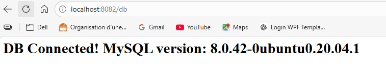

---

## 5. Déploiement du Frontend (server-front)

### 5.1 Mise à jour du système

```bash
echo "nameserver 8.8.8.8" | sudo tee /etc/resolv.conf
sudo apt update
```

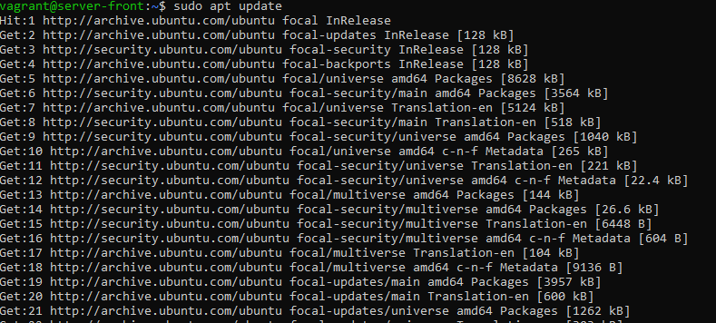

---

### 5.2 Installation de Nginx

Nginx est un serveur web qui va servir les fichiers statiques de l'application React :

```bash
# Installe Nginx
sudo apt install -y nginx
```

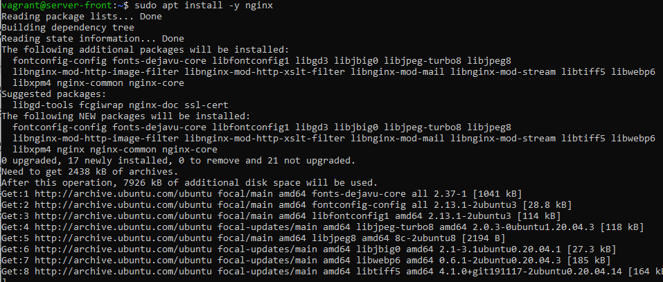

---

### 5.3 Vérification de Nginx

```bash
# Vérifie que Nginx est bien démarré
# Les fichiers sont servis depuis /var/www/html/ par défaut
sudo systemctl status nginx
```

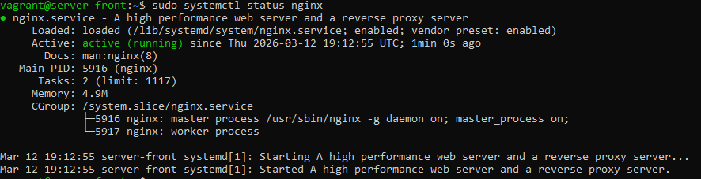

---

### 5.4 Installation de Node.js

Node.js est nécessaire pour compiler l'application React :

```bash
# Installe Node.js depuis les dépôts Ubuntu
sudo apt install -y nodejs
```

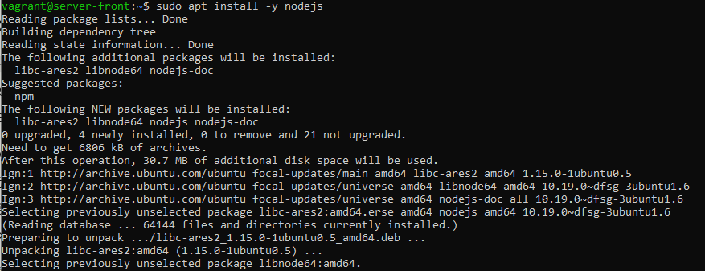

---

### 5.5 Vérification Node.js et npm

```bash
node -v   # Doit afficher v20.x.x
npm -v    # Doit afficher 10.x.x
```

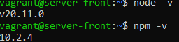

---

### 5.6 Création de l'application React

```bash
# Crée une application React avec le template par défaut
# Cela génère toute la structure du projet automatiquement
npx create-react-app frontapp
```

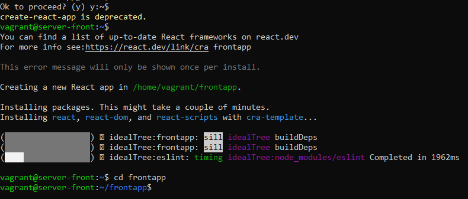

---

### 5.7 Création des fichiers React avec Vite

On utilise **Vite** comme bundler (plus rapide que Webpack). On crée les fichiers manuellement :

```bash
# Fichier de configuration Vite
cat > vite.config.js << 'EOF'
import { defineConfig } from 'vite'
import react from '@vitejs/plugin-react'
export default defineConfig({ plugins: [react()] })
EOF

# Point d'entrée HTML
cat > index.html << 'EOF'
<!DOCTYPE html>
<html><body>
  <div id="root"></div>
  <script type="module" src="/src/main.jsx"></script>
</body></html>
EOF

# Composant principal React — appelle le backend Spring Boot
cat > src/App.jsx << 'EOF'
import { useState, useEffect } from 'react'
function App() {
  const [message, setMessage] = useState('Chargement...')
  useEffect(() => {
    fetch('http://192.168.56.10:8080/')    // Appel vers server-back
      .then(res => res.text())
      .then(data => setMessage(data))
  }, [])
  return <div><h1>Application 3-Tiers</h1>{message}</div>
}
export default App
EOF
```

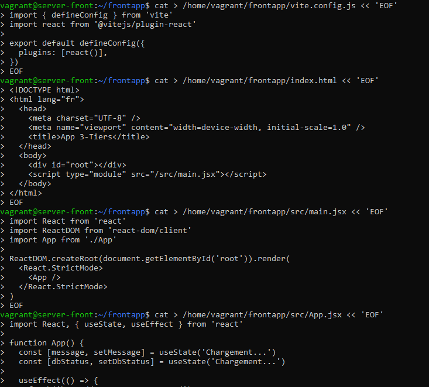

---

### 5.8 Build et déploiement sur Nginx

```bash
# Compile l'application React en fichiers statiques (HTML/CSS/JS)
# Les fichiers sont générés dans le dossier dist/
npm run build

# Copie les fichiers compilés dans le dossier servi par Nginx
sudo cp -r /home/vagrant/frontapp/dist/* /var/www/html/

# Redémarre Nginx pour prendre en compte les nouveaux fichiers
sudo systemctl restart nginx
```

> **Pourquoi compiler ?** React est du JSX (JavaScript + XML) que les navigateurs ne comprennent pas directement. Vite le transforme en JavaScript standard optimisé.

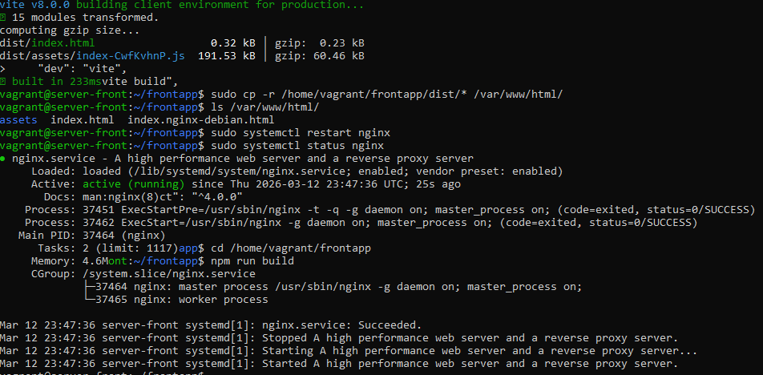

---

## 6. Résultat Final

L'application 3-tiers est entièrement fonctionnelle et accessible sur `http://localhost:8083`.
Le frontend React communique avec le backend Spring Boot qui lui-même est connecté à MySQL :

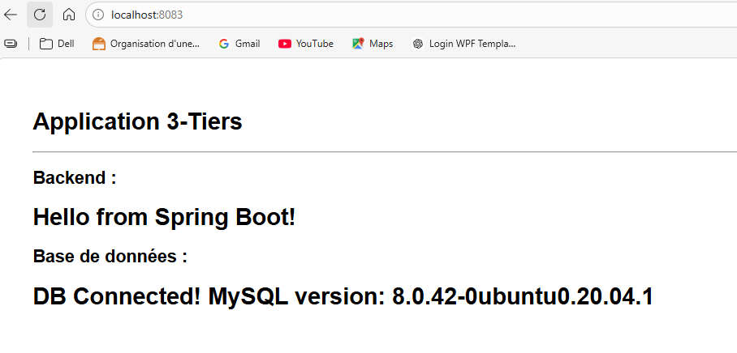

---

## 7. URLs d'accès

| URL | Description |
|---|---|
| http://localhost:8083 | Frontend React (via Nginx) |
| http://localhost:8082 | Backend Spring Boot |
| http://localhost:8082/db | Test connexion MySQL |

---

## 8. Problèmes rencontrés et solutions

| Problème | Cause | Solution |
|---|---|---|
| `Communications link failure` | IP en conflit entre les 2 VMs | Changer l'IP de server-web en `192.168.56.10` |
| `Temporary failure resolving` | DNS VirtualBox non configuré | `echo "nameserver 8.8.8.8" > /etc/resolv.conf` |
| `Access denied for user 'vagrant'` | Plugin auth MySQL 8 incompatible avec JDBC | Utiliser `IDENTIFIED WITH mysql_native_password` |
| `Failed to fetch` (frontend) | Politique CORS du navigateur | Ajouter `@CrossOrigin(origins = "*")` sur le controller |
| `Port 8080 already in use` | Spring Boot déjà lancé en arrière-plan | `sudo fuser -k 8080/tcp` puis relancer |
| `No route to host` | Les 2 VMs avaient la même IP `192.168.56.11` | Corriger le Vagrantfile et faire `vagrant reload` |